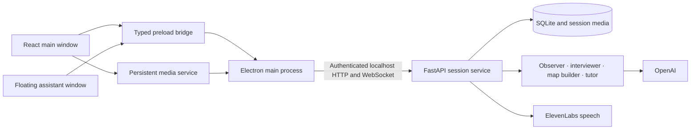

# AI Apprentice

AI Apprentice is a desktop application for turning an expert's real work into teachable knowledge. It records a selected screen or window, accepts the expert's notes, asks questions about consequential actions during natural pauses, and builds an evidence-linked **Work Map**. A confirmed map can then support practice exercises and advisory coaching for a trainee.

The current application is **v0.2.0**. Its main window and independent floating assistant are built with Electron. A bundled Python service handles session data, AI analysis, voice requests, and teaching logic. A fresh installation opens with empty states; the application does not ship example workflows, conversations, screenshots, or exercises.

## What is available now

- Local screen or window recording, saved as WebM segments. Pause stops capture and microphone tracks; resume starts a new segment. Recording continues while navigating pages or minimizing the main window.
- Optional cloud analysis of sampled screenshots through OpenAI. The observer proposes actions and questions; a pause policy limits interruptions. Manual notes and local recording work without API credentials.
- Typed notes, reference text, and explicit voice answers. ElevenLabs handles speech synthesis and transcription when configured. Spoken prompts start muted, and the microphone opens only when the user selects Voice.
- Evidence-linked draft Work Maps. The expert can edit, verify, reject, and confirm steps before they are used for teaching.
- Debrief questions, practice exercises derived from a confirmed map, and advisory live coaching. Generated exercises are labeled as hypothetical; trainee activity remains separate from expert evidence.
- Local Library, Work Map export to Markdown/JSON/HTML, legacy live-session import, and evidence deletion with confirmation.

## Screens and sections

The slim sidebar opens the screens below. The top bar identifies the current workspace and links to the open workflow. If no workflow is open, screens that need one explain the next action instead of showing sample data.

| Screen | Sections and intended use |
| --- | --- |
| **Home** | Three action cards start recording, open saved Work Maps, or enter Teach Mode. **Recent workflows** lists real saved sessions with their step count and confirmation state. |
| **Record** | The **recording bar** shows state and elapsed time, with Record, Pause, Resume, and Stop controls. The **preview** shows a selected window when safe; it is hidden for full-display capture to avoid a recursive mirror. The **process timeline** lists observed actions and their linked sources when analysis is enabled. The right **AI Assistant** panel shows conversation history, pending questions, note entry, voice controls, and cloud/voice preferences. |
| **Workflows** | Search and open saved workflows, see each map's draft or confirmed state, or start another recording. Selecting a workflow opens its Work Map. |
| **Work Map** | **Build from evidence** requests a draft; each step shows the action, decision, reason, rule, exception, guardrail, escalation, status, and source links. **Review** edits a step and changes its status. **Confirm** is available after retained steps are verified. **Debrief** opens the gap-closing conversation; **Export** writes Markdown with assets, JSON, and standalone HTML. |
| **Debrief** | The central card requests one evidence-supported question at a time and links back to the Work Map. The adjacent assistant panel holds the question, typed/voice answer controls, and conversation history. The model may find no further supported question. |
| **Teach Mode** | Requires a confirmed Work Map. **Guided practice** generates hypothetical questions grounded in verified steps, accepts written answers, and shows advisory feedback and actual answer progress. **Live coaching** samples a trainee's selected screen and offers grounded warnings without controlling the other application. **Ask about this workflow** is a separate tutor conversation tied to the confirmed map. |
| **Library** | **Add reference context** saves expert-supplied text. **Recordings** opens completed local video segments. **Notes & screenshots** lists evidence, opens linked images, and offers a confirmed Forget action that invalidates derived knowledge and removes affected session media. |
| **Settings** | **AI connections** stores, checks, replaces, or removes OpenAI and ElevenLabs keys and sets model/voice IDs. **Recording boundaries** explains local storage and when data is sent to providers. **Bring your existing work** imports live sessions from the earlier Qt application without changing the originals; demo sessions are skipped. |

The **floating assistant** is its own transparent, always-on-top window, so it can sit over another application while the main window is minimized. Drag its orb to move it; click to expand icon controls for Record/Stop, Context, Voice, Mute/Unmute, and Open App. Tooltips name the controls. A question card offers Answer, Type Instead, and Later. Press **Ctrl+Shift+Space** on Windows or **Cmd+Shift+Space** on macOS to give the orb keyboard focus.

The **recording setup dialog** asks for a workflow title, optional context, a real screen/window source, and explicit cloud-analysis choice for a new session. Resume or live coaching uses source selection without inventing a new workflow.

## Technology stack

| Layer | Current implementation |
| --- | --- |
| Desktop shell | Electron and TypeScript; native windows, overlay placement, source selection, permissions, file writes, process lifecycle, and narrow IPC handlers. |
| Interface | React 19, Vite, Tailwind CSS 4, Radix/shadcn controls, Lucide icons, Motion transitions, and Zustand state. |
| Capture | Chromium `getDisplayMedia` and `MediaRecorder`; browser WebM segments, sampled JPEG frames, and explicit microphone capture. |
| Local service | Python 3.12, FastAPI, Uvicorn, Pydantic, Pillow, HTTPX, and the OpenAI SDK. |
| Storage | SQLite session snapshots and session-owned media files; a dedicated repository worker serializes database operations. |
| AI and voice | OpenAI for observation, questions, knowledge drafts, exercises, and tutoring; ElevenLabs HTTP APIs for text-to-speech and speech-to-text. |
| Distribution and tests | PyInstaller bundles the Python sidecar; electron-builder creates desktop packages. Pytest, Vitest, and Playwright exercise the service, renderer, and native Windows flows. |

### How the parts communicate



Electron starts the Python sidecar on a free loopback port with a fresh per-launch token. Electron main keeps the token out of renderers and passes provider credentials to backend memory when needed; renderers use the limited preload bridge. Python owns session state and bounded AI jobs. Model calls use session snapshots, and results made stale by edits, privacy actions, or session changes are discarded. Media streams live outside page components, so page navigation does not restart a recording.

The shared Python domain, evidence, scoring, rule, storage, export, and AI-role modules live in `apprentice/`; the active headless API and orchestration live in `backend/`. The historical Qt controller and QML interface remain in the repository for reference and old regression tests. The Electron executable excludes those modules and demo content. The [architecture guide](docs/ARCHITECTURE.md) explains each major file.

## Run the desktop application locally

Development requires **Python 3.12** and **Node.js 22 or later**. From the repository root on Windows:

```powershell
python -m venv .venv
.\.venv\Scripts\python.exe -m pip install -r requirements.txt
cd app
npm ci
npm run dev
```

On macOS, use `.venv/bin/python -m pip install -r requirements.txt`, then the same `cd app`, `npm ci`, and `npm run dev` commands. `npm run dev` builds and launches the local Electron app; `npm start` launches the most recent build. The root `python main.py` is a compatibility launcher for Electron. A developer can use a root `.env` based on `.env.example`; the app also offers encrypted credential entry in Settings.

For a first task: configure provider keys if needed, start a recording from Home, select the source and cloud setting, add intent notes while working, then Debrief and build/review the Work Map. Confirm the map before opening practice or live coaching. The [user guide](docs/USER_GUIDE.md) covers these controls and the deletion flow.

## Build a desktop package

Install build requirements and bundle the Python service before packaging Electron:

```powershell
.\.venv\Scripts\python.exe -m pip install -r requirements-build.txt
.\.venv\Scripts\python.exe tools/build_backend.py
cd app
npm run package
```

On macOS, replace the Windows Python path with `.venv/bin/python`. Packages are written to `release/electron/`. A Windows NSIS installer and unpacked app were built and tested locally. macOS DMG targets and Intel/Apple Silicon CI jobs are configured; native Mac build, permissions, overlay, signing, and notarization checks remain. Users of the packaged application do not need separate Python or Node installations. The older `dist/AI-Apprentice` and `dist/ui-refresh` folders are Qt builds.

## Verification and current limits

The most recent local checks passed **60 Python tests**, **4 renderer/voice tests**, and **2 desktop tests against the packaged Windows executable**, including real display capture, minimize, pause/resume, note persistence, and overlay controls. The packaged Python service also passed an isolated startup check. See [testing details and outstanding release checks](docs/TESTING.md).

Live OpenAI and ElevenLabs sessions require the user's own credentials and were not exercised in that packaged acceptance run. macOS packages have not been verified on this Windows host. The Windows installer is unsigned. The application does not record system audio, redact sensitive screen content automatically, sync sessions to a cloud account, or control external applications. Once cloud analysis or voice data has been sent to a provider, turning it off cannot recall that earlier request.

Additional documentation: [development and troubleshooting](docs/DEVELOPMENT.md) and [visual design rules](docs/UI_DESIGN.md).
