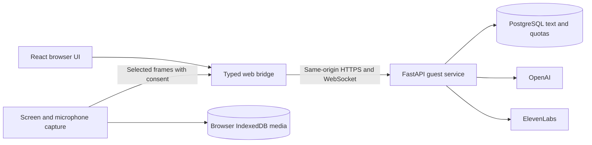

# AI Apprentice

AI Apprentice captures how an expert completes a task, asks clarifying questions, and turns recorded evidence into a reviewed **Work Map** that can teach someone else. The application starts with an empty workspace; it does not ship sample workflows, conversations, exercises, or invented AI results.

## Which version is current?

**`main` is the browser application.** It uses React and FastAPI and is designed for a working Replit URL. The [Replit project](https://replit.com/@nsbarnett/hack-nationeleven-labs) runs a development preview. A permanent public deployment is still pending Replit publishing and owner-provided OpenAI and ElevenLabs keys; the development preview is not the submission URL.

The [**`electron-desktop-backup` branch**](https://github.com/nsbarnett/hack-nation_eleven-labs/tree/electron-desktop-backup) preserves the last Electron-only application at version 0.2.0, including its floating desktop assistant and desktop build instructions. The browser edition is version 0.3.0. Electron source remains in `main` because the two editions share React components and Python domain logic, but the Replit build and supported entry point on `main` are browser-based.

## What the browser app does

The main path is **Capture → Work Map → Teach**:

1. Name a real workflow and click **Start recording**. Chrome or Edge asks which screen or window to share. You choose whether sampled frames may be analyzed by AI. Add text notes at any time.
2. During capture, the assistant can observe opted-in frames and ask about decisions when the page detects a pause. You can answer in text or explicitly start a microphone answer. Questions and controls remain in the browser page.
3. Request a debrief question, then build a Work Map from the recorded evidence. Edit, reject, or verify each step. Only reviewed, verified knowledge can be confirmed for teaching.
4. Generate practice from the confirmed map or use advisory coaching while sharing a trainee screen. Exercises are labeled as generated, and trainee answers do not become expert evidence.

Recording and manual notes work without AI credentials. Model-dependent actions show a clear error when the owner's connection is unavailable. The browser cannot place the Electron floating orb over another program or detect keyboard activity outside the page.

### Screens

| Screen | Purpose |
| --- | --- |
| **Home** | Start capture, reopen an actual saved workflow, or enter Teach Mode. A new guest sees an empty state. |
| **Record** | View recording state and elapsed time, pause/resume/stop, see a safe live preview and process timeline, and add notes or answer assistant questions. Full-display previews are hidden to avoid a recursive mirror. |
| **Workflows** | Search and reopen saved workflows and see whether their maps are draft or confirmed. |
| **Work Map** | Build a draft from evidence, inspect source links, edit and verify steps, confirm reviewed knowledge, and export the session/map as JSON. |
| **Debrief** | Request one evidence-supported question at a time and record the expert's explanation. |
| **Teach** | Generate practice from a confirmed map, review answer feedback, ask the tutor about the workflow, or enable advisory coaching during a trainee task. |
| **Library** | Add reference text, review notes and screenshots, play or download browser-local recordings, and forget evidence with confirmation. |
| **Settings** | See owner-managed AI/voice availability, review data boundaries, and delete the open workflow and its browser media. |

## Technology and data flow

| Part | Current implementation on `main` |
| --- | --- |
| Interface | React 19, TypeScript, Vite, Tailwind CSS 4, Radix primitives, Lucide icons, Motion, and Zustand. |
| Browser capture | User-initiated `getDisplayMedia`, `MediaRecorder` WebM segments, selected JPEG frames, and explicit microphone access. |
| Browser storage | IndexedDB holds video and screenshots locally, scoped by guest and workflow. Full recordings are never uploaded. |
| Hosted service | Python 3.12, FastAPI, Pydantic, Pillow, HTTPX, OpenAI SDK, and psycopg. One process serves the React build and authenticated guest API. |
| Hosted storage | Replit PostgreSQL stores guest-scoped text sessions, Work Maps, practice state, and durable provider-call quotas. |
| AI and voice | OpenAI handles observation, questions, knowledge drafts, exercises, and tutoring. ElevenLabs HTTP APIs provide turn-based speech and transcription when configured. |



`app/src/web/bridge.ts` connects the shared React pages to `backend/web.py`. `backend/hosted_service.py` applies the browser command and privacy boundaries; `backend/hosted_store.py` isolates each guest's text. `backend/service.py` and `apprentice/` contain the reusable session, evidence, scoring, question, Work Map, and tutoring logic. The browser build does not run the Electron main process or the older Qt interface. See the [architecture guide](docs/ARCHITECTURE.md) and [hosted file guide](docs/REPLIT.md) for details.

### Privacy and limits

- Video and screenshots remain in the capturing browser's IndexedDB. Selected frames are sent only after cloud analysis is enabled. The server keeps at most three recent frames per guest in memory; it does not save image files.
- Text and maps are stored under an opaque signed guest cookie. No account or cross-device sync is provided. Inactive hosted workflows expire after seven days. Export important work before clearing browser data or losing that cookie.
- Browser capture is limited to five minutes and 100 MB of local media per workflow. Microphone access starts only when you choose a voice action. No system audio is recorded.
- Deleting evidence invalidates derived knowledge and removes affected browser media. Data already sent to a provider cannot be recalled.

## Run the browser app locally

Install **Python 3.12** and **Node.js 22+**. From the repository root on Windows PowerShell:

```powershell
python -m venv .venv
.\.venv\Scripts\python.exe -m pip install -r requirements-web.txt
cd app
npm ci
npm run build:web
cd ..
$env:APP_ENV = 'development'
.\.venv\Scripts\python.exe -m backend.web
```

Open `http://localhost:3000` in Chrome or Edge. On macOS or Linux, use `.venv/bin/python` and `export APP_ENV=development`. Development defaults to `.artifacts/web-data.sqlite3`; a root `.env` based on `.env.example` can provide optional provider keys. Production requires a PostgreSQL `DATABASE_URL` and a stable `GUEST_SECRET` or Replit-provided `SESSION_SECRET` of at least 32 characters.

For Replit build, database, Secrets, Reserved VM publishing, and acceptance steps, follow [docs/REPLIT.md](docs/REPLIT.md). The Electron backup's README contains its separate build and packaging instructions.

## Verification status

Local checks passed **72 Python tests**, **4 renderer tests**, and **4 Edge browser tests**. Browser tests cover permission denial, capture across navigation, pause/resume, local media, debrief, map review and confirmation, teaching, reload, deletion, isolation, and connection recovery. Test model responses and capture frames live only in test fixtures. A separate check made real OpenAI calls for a debrief question, evidence-linked map, and grounded practice using disposable notes. The imported Replit project built successfully; its development PostgreSQL passed isolation and reconnect checks.

The public Replit URL, real ElevenLabs voice, browser screen permissions on the published site, and production database still need final acceptance. No hosted release should be treated as verified until those checks pass. See [testing notes](docs/TESTING.md).
