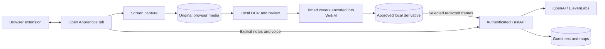

# AI Apprentice

Evaluation dimensions, parameters, gap decisions, and regression commands are documented in [docs/EVALUATION.md](docs/EVALUATION.md).

Record real work, review sensitive screen content locally, then turn approved evidence into a Work Map and grounded teaching exercises. New workspaces are empty: no sample workflows, conversations, metrics, or fallback AI results are installed.

**`main` is the browser edition, version 0.5.0.** The [Electron desktop backup](https://github.com/nsbarnett/hack-nation_eleven-labs/tree/electron-desktop-backup) preserves version 0.2.0. Desktop source remains for shared logic, but the supported entry point on `main` is FastAPI serving the browser app. This change does not rebuild the Electron installer.

The [Replit workspace](https://replit.com/@nsbarnett/hack-nationeleven-labs) is the hosting target. This revision and its extension are built locally; a published production URL is **not verified**. Follow [Replit setup](docs/REPLIT.md) to rebuild/restart or publish. A development preview is not a permanent submission URL.

## The workflow

**Record → Detect locally → Review and redact → Approve → Analyze → Work Map → Teach**

1. Name a workflow and select an entire screen, window, or supported browser tab using Chrome/Edge's sharing prompt. Keep Apprentice open. Capture continues across navigation; pause stops tracks and resume creates another segment.
2. Video and sampled screenshots stay in IndexedDB. Local English OCR suggests sensitive moments during capture. After stopping, a sequential scan checks frames for scene changes and runs OCR at half-second intervals and detected cuts. Progress and gaps are shown.
3. In **Privacy Review**, seek to markers, resolve suggestions, draw solid covers, adjust start/end times, and add position keyframes. Split covers at cuts. Add markers/covers wherever detection missed something.
4. Render a separate WebM with covers permanently encoded into its pixels. Preview it, acknowledge reviewing all segments/gaps, and explicitly approve the revision, even if there are no findings.
5. Choose **Analyze approved frames**. AI is built in whenever its provider is connected; reopening and refreshing do not disable it. Only frames decoded from the approved redacted copy are uploaded. Bounded before/after selection helps capture visible changes. Analysis automatically surfaces one supported question, or explains why no new screen question is supported, with a persistent link to Debrief.
6. Build, edit, verify, and confirm the Work Map. Generate labeled practice or ask the tutor about confirmed knowledge. Browser live-screen coaching is withheld under the review-first policy; the Electron backup retains that earlier feature.

Recording, local privacy editing, and manual notes work without provider keys. Detection can miss information, does not recognize faces or general names/addresses, and cannot guarantee safety.

On **Record**, optional reviewer interjections use typed and explicitly initiated voice notes during capture. Choose Text only, Voice only, or Text and voice; mute remains available. Process evidence scores prioritize meaningful gaps. Screens are analyzed only after approval. Context evaluation, question preparation, frame progress, and Work Map processing remain visible across pages. See [scores and decisions](docs/EVALUATION.md) and [challenge brief alignment](docs/BRIEF_ALIGNMENT.md).

## Screens and sections

| Screen | Purpose |
| --- | --- |
| Home | Start capture and reopen actual saved workflows; useful empty states. |
| Record | State, timer, pause/resume/stop, safe preview, observed steps, context, voice answers and optional reviewer interjections with text/voice presentation. During capture: “Recording locally · Privacy review pending.” |
| Privacy Review | Labeled original playback, segments, markers, frame steps, findings, timed covers, keyframes, cut splitting, local scan/render progress, approval, and approved-frame analysis. Explicit deletion of originals after approval. |
| Workflows | Search/open guest-owned workflows and inspect confirmation state. Delete any selected workflow with a named confirmation dialog; recording must stop before deleting the active capture. Home and Settings reuse this deletion flow. |
| Work Map | Build an evidence-linked draft, edit/reject/verify steps, confirm knowledge, and export JSON. |
| Debrief | Request supported follow-up questions and capture expert explanations. |
| Teach | Generate grounded exercises, keep trainee answers separate, calculate actual progress and ask a tutor about confirmed knowledge. |
| Library | Reference text, notes, approved images, approved redacted playback/download, and forgetting evidence. No raw-video fallback. |
| Settings | Provider availability, retention/privacy, workflow deletion, extension ZIP and setup instructions. |

## Floating Chrome/Edge companion

The Manifest V3 extension places a draggable orb on permitted ordinary websites. Record/Stop, Context, Voice, Mute, and Open App control one open Apprentice tab. New capture requires a click in that tab's sharing dialog; voice focuses it for microphone permission.

The orb stays mounted in a fixed-size iframe. Mounted controls animate with opacity/transforms; hover only shows labels. Extension-owned panels isolate note/question content from the host page. Outside panels, clicks reach the website. A temporary drag surface exists only during dragging. Alt + arrows move the focused orb; reduced-motion preferences are respected.

Build outputs:

- `release/extension/apprentice-extension.zip`
- `release/extension/unpacked/`
- `app/dist/downloads/apprentice-extension.zip`, served by FastAPI/Replit

See [extension setup](docs/EXTENSION.md). This is an unpacked companion, not a Web Store listing. It cannot float over native applications or operate on protected browser pages.

## Technology and architecture

| Layer | Implementation |
| --- | --- |
| UI | React 19, TypeScript, Vite, Tailwind CSS 4, Radix, Motion, Zustand, Lucide. |
| Capture | getDisplayMedia, MediaRecorder WebM segments, explicit microphone capture. No system audio. |
| Local privacy | Tesseract.js 7 with packaged English/WASM assets; bounded workers; normalized timed covers; WebCodecs + Mediabunny decoding and real WebM rendering. |
| Local storage | IndexedDB chunks, original/derivative identity, segment timing, markers, keyframes, scan gaps and review revisions. |
| Extension | MV3 service worker, isolated content script, extension-owned iframes, typed allowlists and stale/replay checks. |
| API/domain | Python 3.12, FastAPI, Pydantic, Pillow, HTTPX, OpenAI SDK. Scoring/evidence validation remain deterministic services. |
| Hosted storage | Guest-isolated Replit PostgreSQL text/maps/quotas; local-development SQLite. |
| Providers | OpenAI for approved visual evidence, knowledge and teaching; ElevenLabs turn-based speech/transcription. Server-side keys only. |



`/api/frame` rejects live browser uploads. `/api/reviewed-frame` requires the current session and approved privacy revision. Editing invalidates approval/derived screen knowledge and cancels stale AI results. Dispatched provider calls cannot be recalled. See [architecture/file guide](docs/ARCHITECTURE.md) and [privacy design](docs/PRIVACY.md).

## Run locally

Install Python 3.12 and Node 22+, then in PowerShell:

```powershell
python -m venv .venv
.\.venv\Scripts\python.exe -m pip install -r requirements-web.txt
cd app
npm ci
npm run build:web
cd ..
$env:APP_ENV = 'development'
.\.venv\Scripts\python.exe -m backend.web
```

Open `http://localhost:3000`. On macOS/Linux use `.venv/bin/python` and `export APP_ENV=development`. Build **before** starting the server: the build packages OCR assets and the extension. Development defaults to `.artifacts/web-data.sqlite3`. A root `.env` may provide optional `OPENAI_API_KEY` and `ELEVENLABS_API_KEY`; never put keys in React or the extension.

Production requires PostgreSQL `DATABASE_URL` and stable `GUEST_SECRET` or `SESSION_SECRET`. Use one Replit Reserved VM process. The existing `.replit` build invokes `npm run build:web`, including the ZIP and OCR assets automatically.

## Storage, limits, and validation

Each workflow has separate **100 MB source** and **100 MB derivative** budgets plus the existing five-minute capture limit. Rendering checks browser space and preserves originals/drafts on failure or cancellation. Normal playback/download requires an approved derivative. Originals are available only in the review editor. Browser eviction/clearing data can remove local media.

Guest text expires after seven inactive days; guest cookies expire after seven days. No accounts or cross-device sync. Covers do not redact audio or typed notes and cannot reverse older provider disclosures.

See [testing and remaining acceptance](docs/TESTING.md). Automated tests use real MediaRecorder, IndexedDB, OCR and encoding with test-only capture/provider fixtures. They do not prove production provider availability or successful Replit publication.
