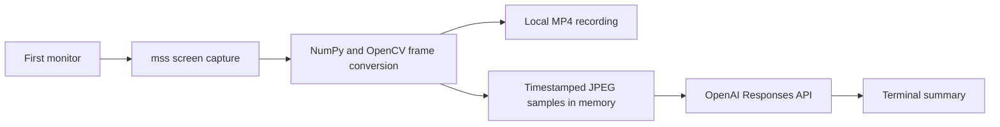
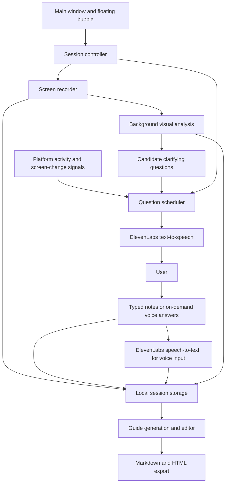

# hack-nation_eleven-labs

**TaskLens** is a desktop application concept that records a workflow, asks clarifying questions through AI voice during natural pauses, and turns the recording and answers into a step-by-step guide.

Built for the Hack-Nation hackathon. The repository currently contains a Python screen-recording and visual-analysis proof of concept. The desktop interface, floating bubble, ElevenLabs integration, and guide editor described below are planned work.

## Current status

| Capability | Status |
| --- | --- |
| Record the first monitor to a local MP4 | Implemented |
| Sample timestamped screenshots during recording | Implemented |
| Send sampled screenshots to OpenAI for a chronological summary | Implemented |
| Print the summary to the terminal | Implemented |
| Desktop main window and floating control bubble | Planned |
| User-controlled recording duration and monitor selection | Planned |
| Live analysis and questions during pauses | Planned |
| ElevenLabs spoken questions and answer transcription | Planned |
| Editable guide with screenshots and export | Planned |
| Local session history and standalone Windows/macOS builds | Planned |

The current script starts recording immediately when executed, records for 20 seconds, and then requests a summary. It has no GUI, microphone input, system-audio capture, or ElevenLabs dependency yet. Windows and macOS are the intended desktop targets; cross-platform application packaging and validation are still pending.

## Product experience

1. Open the desktop app, describe the task, and select a monitor.
2. Start recording and work normally in other applications.
3. Minimize the main window to a draggable floating bubble.
4. Use the bubble to start or stop recording, add text or voice context, mute assistant speech, disable automatic questions, or reopen the main window.
5. Let the assistant ask short questions when computer activity pauses and more context would improve the documentation.
6. Answer by voice or text. The microphone is active only for answers and explicitly started voice notes.
7. Stop recording, review an editable guide, and export the result.

Example: after observing an export workflow, the assistant might ask, "What made you choose this export format?" The answer explains intent that screenshots alone cannot establish.

## Architecture

### Current proof of concept



`main.py` runs this flow sequentially. It uses a monotonic clock to pace capture, writes frames with OpenCV, samples JPEGs approximately every two seconds, and sends those samples in one request after recording completes. The full MP4 is saved locally; the current analysis request contains sampled images and timestamps, not the video file.

The analysis prompt distinguishes visible evidence from inferred intent, avoids claiming success without evidence, and treats text inside screenshots as content rather than instructions.

### Planned desktop application



| Component | Responsibility |
| --- | --- |
| Desktop UI | Session setup, history, guide editing, and a separate floating control window |
| Session controller | Shared recording state, start/stop actions, assistant preferences, and orderly shutdown |
| Capture service | Continuous recording, timestamped frame sampling, and monitor/device errors |
| Analysis service | Bounded screenshot batches, observed actions, rolling context, and proposed questions |
| Question scheduler | Decide when a relevant question can be delivered without interrupting active work |
| Voice service | Speak questions and transcribe explicitly enabled answers or notes |
| Session store | SQLite metadata and evidence references, with media files stored on disk |
| Guide service | Turn observed actions and user explanations into editable, evidence-linked steps |
| Platform adapters | Windows/macOS permissions, idle-time signals, and window behavior |

Both windows will use the same controller. Hiding the main window must not stop recording. Network requests and expensive image processing will run outside the UI thread, and analysis queues will remain bounded so long sessions do not accumulate every frame in memory.

The planned capture backend is Qt Multimedia, replacing the prototype's capture loop while retaining its timestamped visual-analysis approach. The recording, analysis, voice, and storage services will stay separate from the UI so each can evolve independently.

### Question timing and microphone behavior

The model proposes what to ask; the application decides when to ask it. Initial, tunable defaults are:

- At least eight seconds without mouse or keyboard activity.
- Screen content largely stable for three seconds.
- At least 60 seconds since the previous question.
- Only one pending question, with no answer, voice note, or assistant playback in progress.
- Recheck activity and relevance before delivery; discard stale or duplicate questions.

With an on-demand microphone, a "pause" means computer inactivity, not verified conversational silence. The app cannot know whether the user is speaking to someone while its microphone is off.

After a spoken question finishes, the planned answer flow shows a listening indicator and stops after two seconds of silence, a 30-second limit, or the user's Done action. Muting assistant speech retains text questions; disabling automatic questions suppresses interruptions. Text-only questions require an explicit action to enable the microphone.

## Tech stack

### Included today

| Technology | Purpose |
| --- | --- |
| Python 3.12 | Reference development runtime |
| `mss` | Monitor screenshots |
| NumPy | Frame-array processing |
| OpenCV (`opencv-python`) | Color conversion, JPEG encoding, and MP4 writing |
| OpenAI Python SDK | Responses API requests with timestamped images |
| `gpt-4.1` | Model currently selected in `main.py` |

`requirements.txt` pins the four direct third-party dependencies to the versions in the existing development environment. It is not a complete transitive dependency lockfile.

### Planned additions

| Technology | Purpose |
| --- | --- |
| PySide6 / Qt Widgets | Main desktop window and floating bubble |
| Qt Multimedia | Desktop recording and audio integration |
| ElevenLabs Python SDK | Text-to-speech questions and speech-to-text answers |
| SQLite | Local session metadata, notes, and evidence references |
| Local filesystem | Video, screenshots, and exported guides |
| `pyside6-deploy` | Standalone application builds for Windows and macOS |

Python + PySide6 is the chosen prototype direction because it reuses the existing Python foundation and supports desktop windows without a browser. PySide6 also supports Qt Quick/QML if a more customized animated UI is needed later. The prototype does not require a web server or a cloud database.

## Run the current prototype

### Prerequisites

- Python 3.12 and Git.
- A graphical desktop session with at least one available monitor.
- Permission to capture the screen. On macOS, allow Screen Recording for the terminal or application hosting Python when requested.
- An OpenAI API key with access to the model used in `main.py`, and internet access for the summary request.

ElevenLabs credentials are not needed for the current script.

### Windows / PowerShell

```powershell
git clone https://github.com/nsbarnett/hack-nation_eleven-labs.git
cd hack-nation_eleven-labs
python -m venv .venv
.\.venv\Scripts\python.exe -m pip install -r requirements.txt
$env:OPENAI_API_KEY = "your-openai-api-key"
.\.venv\Scripts\python.exe main.py
```

### macOS / terminal

```bash
git clone https://github.com/nsbarnett/hack-nation_eleven-labs.git
cd hack-nation_eleven-labs
python3.12 -m venv .venv
.venv/bin/python -m pip install -r requirements.txt
export OPENAI_API_KEY="your-openai-api-key"
.venv/bin/python main.py
```

These commands invoke the virtual environment directly, so activation is unnecessary. `main.py` reads `OPENAI_API_KEY` from the process environment through the OpenAI SDK. It does **not** automatically load a `.env` file; a key stored only in that file is insufficient for the commands above.

The script immediately records the first monitor for 20 seconds, writes `screen_recording.mp4` in the working directory, and then prints its AI summary. Each run uses the same output filename; rename or move a recording before running again if you want to keep it. The summary is printed, not saved as a guide.

### Configuration

Current settings are constants or arguments in `main.py`:

| Setting | Default | Meaning |
| --- | --- | --- |
| `DURATION` | `20` | Recording duration in seconds |
| `FPS` | `10` | Target video frame rate |
| `SAMPLE_INTERVAL` | `2` | Approximate seconds between analysis screenshots |
| `OUTPUT` | `screen_recording.mp4` | Local output filename |
| Monitor | `capture.monitors[1]` | First enumerated monitor |
| Model | `gpt-4.1` | OpenAI model for visual summarization |
| JPEG quality | `85` | Quality of sampled images |

There are no command-line flags or settings UI yet. Increasing duration also increases the in-memory screenshot collection and request size; the current loop is intended for short experiments.

## Repository layout

```text
hack-nation_eleven-labs/
├── main.py             # Runnable capture and analysis proof of concept
├── requirements.txt    # Pinned direct dependencies
├── README.md           # Setup, current behavior, and planned design
└── .gitignore          # Local credentials, environments, and generated data
```

Local `.env` files, `.venv/`, recordings, and future session/export folders are excluded from Git.

## Data handling and limitations

- Screen recordings stay on disk in the current implementation. Sampled screenshots are sent to OpenAI for analysis, so their visible contents leave the computer.
- The planned voice flow sends enabled voice input to ElevenLabs for transcription and question text to ElevenLabs for speech generation.
- Credentials must remain local and must not be bundled into a distributed application or committed to Git.
- The current recorder has no redaction, region selection, pause control, microphone capture, session recovery, or automatic retries.
- Sampling every two seconds can miss intermediate actions. Generated explanations require review and must not treat inferred clicks or outcomes as observed facts.
- Capture slower than the target frame rate can cause the MP4 duration to differ from elapsed wall time in the current fixed-frame-rate implementation.
- Qt does not eliminate platform differences in permissions, codecs, monitors, or window behavior. Both desktop targets require real-device testing.
- The floating bubble may appear in prototype recordings. Its region should be excluded from screen-change scoring; reliable capture exclusion is later work.

## Development roadmap

1. **Desktop foundation:** introduce PySide6, a shared session controller, monitor selection, the floating bubble, continuous recording, and local session storage.
2. **Documentation:** add background analysis, evidence-linked steps, guide editing, and Markdown/HTML exports.
3. **Voice interviewing:** integrate ElevenLabs, conservative pause detection, answer association, and immediate mute/disable controls.
4. **Packaging:** build and test standalone Windows and macOS applications, including permission handling and orderly recording shutdown.

Public installers, code signing, automatic updates, cloud sync, continuous microphone narration, system-audio capture, and guaranteed overlays above exclusive full-screen applications are outside the initial prototype.

## Verification

There is no automated test suite yet. A manual smoke test of the current script records the desktop and makes a paid API request; run it only with an appropriate screen visible. Confirm the MP4 opens, the printed timestamps align with visible activity, and the summary distinguishes evidence from inference.

Before the desktop prototype is considered complete, verify on Windows and macOS:

- Start recording, minimize to the bubble, add notes, restore the window, and stop successfully.
- Generate, edit, and export a guide with usable screenshots and user explanations.
- Keep the UI responsive throughout a 30-minute session with bounded analysis memory.
- Handle denied permissions, removed monitors, disconnected microphones, and API failures without losing already saved session evidence.
- Suppress questions during active work, cancel speech immediately when muted, and reject delayed responses from finished sessions.
- Build and launch the packaged app without requiring a separate Python installation.

## Technical references

- [Qt for Python](https://doc.qt.io/qtforpython-6/)
- [Qt screen capture](https://doc.qt.io/qtforpython-6/PySide6/QtMultimedia/QScreenCapture.html)
- [Qt Multimedia platform considerations](https://doc.qt.io/qt-6/qtmultimedia-index.html)
- [PySide6 deployment](https://doc.qt.io/qtforpython-6/deployment/deployment-pyside6-deploy.html)
- [ElevenLabs Python SDK](https://github.com/elevenlabs/elevenlabs-python)

## License

No project license has been selected yet. This repository does not currently grant an open-source license; dependency licenses apply separately to their respective components.
