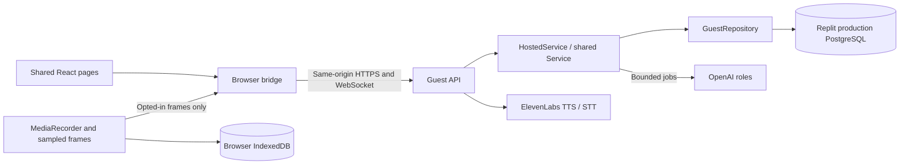

# Browser edition: setup and operation

The hosted entry point is `python -m backend.web`. It serves `app/dist` and the guest API from one process on port 3000. The Electron entry point and its authenticated localhost API remain independent. This document describes implemented behavior; the final section records which checks still require the published environment.

## Publish on Replit

1. Import this GitHub repository into a Replit app. Use Python 3.12 and Node 22; `.replit` declares both. Do not launch `main.py`, which starts Electron.
2. Add a Replit SQL database. Configure a **production database** for the published app. Its `DATABASE_URL` must be available to the deployed process; development and production databases are separate. Do not copy development guest sessions into production.
3. In Replit Secrets, add `GUEST_SECRET` (a stable random value of at least 32 characters), `OPENAI_API_KEY`, and `ELEVENLABS_API_KEY`. Generate the guest secret with a password manager or `python -c "import secrets; print(secrets.token_urlsafe(48))"`. Keep it out of source control. Changing it invalidates guest cookies. Set `APP_ENV=production` (also the default).
4. Optional configuration: `OPENAI_MODEL` (default `gpt-4.1`), `ELEVENLABS_VOICE_ID`, `ELEVENLABS_TTS_MODEL`, `ELEVENLABS_STT_MODEL`, `HOSTED_GUEST_AI_CALLS` (default 100/day), and `HOSTED_DAILY_AI_CALLS` (default 1000/day). Both call limits must be positive. Calls, including failed attempts, consume the shared allowance. Provider-side spending caps remain advisable because call count is not a dollar budget.
5. Install and build in the workspace: `python -m pip install -r requirements-web.txt`, then `cd app && ELECTRON_SKIP_BINARY_DOWNLOAD=1 npm ci && npm run build:web`. The production build command in `.replit` performs the same steps. No Electron binary is needed by the web server.
6. Publish using **Reserved VM**, one process/worker, port 3000. Use the build and run commands in `.replit`. Confirm that production Secrets include the database URL and the provider/guest secrets. `/healthz` checks the database; `/` opens the app. Open the published URL in a standalone Chrome or Edge tab, not just the editor's embedded preview.
7. Optionally set `PUBLIC_ORIGIN` to the exact published HTTPS origin. Without it, requests must match the HTTPS Host header. Use a single canonical URL: guest cookies and local media belong to an origin.
8. Complete the published acceptance checklist below. Submit the published HTTPS URL, not the Replit editor URL or a temporary development preview.

The app refuses production startup without PostgreSQL and the guest signing secret. Missing provider keys leave manual capture and notes available, with explicit errors for AI or voice. Never use the test fixture server for publishing.

References: [Replit configuration](https://docs.replit.com/features/project-setup/configuration), [deployment types](https://docs.replit.com/features/publishing/deployment-types), [development and production databases](https://docs.replit.com/features/data-and-storage/development-and-production).

## Local setup

Install `requirements-web.txt`, run `npm ci` and `npm run build:web` in `app/`, then set `APP_ENV=development` and run `python -m backend.web` at the repository root. On Unix: `APP_ENV=development python -m backend.web`. On PowerShell: `$env:APP_ENV='development'` before the Python command.

Development falls back to `.artifacts/web-data.sqlite3` and a development-only signing secret. A root `.env` can supply provider settings; process environment variables take precedence. Production requires an actual PostgreSQL URL. Python never needs Qt for either headless backend.

## Data flow and file responsibilities

| File | Responsibility and significant decision |
| --- | --- |
| `.replit` | Python/Node modules, production build/run, Reserved VM and port mapping. |
| `requirements-web.txt` | Headless backend dependencies plus the PostgreSQL driver. |
| `app/src/platform.ts` | Installs the web implementation only when the Electron preload is absent. |
| `app/src/web/bridge.ts` | Same renderer interface as Electron: guest API commands, reconnect events, one active tab via Web Locks, local media reconciliation and JSON export. No filesystem or credential interface is exposed. |
| `app/src/web/localMedia.ts` | IndexedDB assets/chunks scoped by guest and workflow. Each recording chunk is persisted promptly; full blobs are assembled only for playback/download. |
| `app/src/media.ts` | Persistent capture/voice service outside React page lifetimes. Browser permissions start directly from a user click. Pause stops tracks; resume prompts again and starts a new segment. |
| `app/src/components/RecordingSetup.tsx` | Session title/context and cloud consent; browser source selection and actionable permission errors. |
| `app/src/components/CloudConsent.tsx` | Explicit AI choice when reviewing or teaching from a saved workflow. |
| `app/src/web/WebSettings.tsx` | Owner-managed provider availability, data explanation, and workflow deletion. |
| `backend/web.py` | Guest cookie, origin checks, request/upload limits, WebSocket events, concurrency/call quotas, static UI, startup validation. Desktop-only routes are absent. |
| `backend/hosted_service.py` | Whitelisted commands over the reusable learning pipeline. Checks workflow identity, consent, limits, deletion, persisted practice and safe refresh recovery. |
| `backend/hosted_store.py` | PostgreSQL text snapshots with mandatory guest predicates; durable daily quota transactions. Only the last three sampled frame byte strings are cached in memory. SQLite is for local/test use. |
| `backend/service.py` | Shared session owner, evidence handling, question policy, generation-based stale-result rejection, Work Map and tutoring orchestration. Repository and model executor are injected. |
| `backend/voice.py` | Actual ElevenLabs HTTP transport, separate from Qt or browser audio playback. |
| `apprentice/agents/` | Reusable observer, interviewer, knowledge builder and tutor roles. Deterministic scoring/verification remain ordinary services. |
| `tests/test_hosted.py` | Authentication/isolation, quota durability, consent/privacy, cancellation, persistence, provider failure and event contracts. |
| `tests/web_fixture.py` | Test-only deterministic model adapter; never imported by production. |
| `app/tests/web/app.spec.ts` | Edge browser acceptance against the fixture API, real MediaRecorder and IndexedDB. |

## Guest privacy and limits

Guest identity is a random identifier inside an HMAC-signed, Secure, HttpOnly, SameSite cookie. Every database operation scopes by the authenticated guest; a workflow ID alone never authorizes access. Mutations require same-origin requests and a custom header. WebSockets check cookie and Origin. Rendered state contains availability flags, not provider secrets.

Video and JPEGs stay in browser IndexedDB. There is no server video upload or media-download route. With consent, selected frames pass through server memory to OpenAI; observations and text are stored in PostgreSQL. Already-running provider calls can finish after consent is withdrawn, but stale results are rejected and cached frames cleared. Deletion cannot recall earlier provider requests.

Explicit microphone answers go to ElevenLabs for transcription. Audio is not stored by this application. Assistant speech is limited to actual assistant messages in the current workflow. Muting stops playback; text remains visible. No system audio or global keyboard monitoring is used.

Default bounds: five minutes and 100 MB of local media per workflow, ten workflows per guest, 300 evidence items, 2 MB per session text snapshot, 180 API requests/minute per live guest, 1 MB/frame and 2 MB/voice upload. At most 32 guest services, four provider calls concurrently, three jobs per service and three WebSockets per guest are retained. Daily provider quotas persist across process restarts. Guest identities can be reset by clearing cookies, so the global daily limit is the final spend guard, not guest identity alone.

Text workflows expire after seven days of inactivity. The guest cookie expires after seven days; export work before then. The periodic cleanup runs each minute. Clearing browser data removes guest access and local media; browser quota eviction is also possible. Download important videos and export maps. Reload never resumes recording automatically. Completed or interrupted local segments are reconciled with the saved session on reopen; interrupted WebM segments may be partial.

Settings can delete the open workflow and local media after confirmation. Library Forget removes selected evidence, invalidates derived knowledge, and removes affected recording media. Browser-local deletion is attempted after server text deletion; if storage access fails, clearing this site's browser data removes remaining local bytes.

## Verification and troubleshooting

Local automated acceptance: 72 Python tests, four renderer tests and three Edge browser tests passed on Windows. Test model outputs and canvas capture are fixtures confined to tests; these do not prove real screen permissions, PostgreSQL behavior, or a published deployment. Separately, `python tools/check_hosted_live.py` passed three real OpenAI calls for debrief, map generation and practice using disposable synthetic notes. This is an opt-in paid-provider check, not a seeded demo.

For the browser suite, build the UI, then run the fixture API in a separate terminal with `python -m uvicorn tests.web_fixture:app --host 127.0.0.1 --port 3001`. Run `npm run test:web` inside `app/` (installed Edge required). Do not publish that fixture entry point.

Before submission, at the **published URL**:

- Use Chrome/Edge, deny screen permission once, then successfully share a harmless test window. Add notes, navigate, pause/resume, and play/download the actual local recording.
- Enable cloud analysis; receive a real model question and answer it. Unmute and verify real ElevenLabs speech, then explicitly record/transcribe an answer.
- Build/review/confirm a map; generate and answer a grounded exercise. Confirm that gaps and provider failures are shown honestly.
- Open a private browser window: it must start empty and be unable to open the first browser's workflow ID.
- Reload and check persisted text/map/practice plus local video; confirm capture is idle. Delete the test workflow and verify its text and media disappear.
- Inspect production database persistence across a restart. Check actual quotas and production logs without logging cookies, keys, frame payloads or note content.

Common issues: 503 on `/` means the UI has not been built; startup failure usually means missing production DB/secret; 403 means Origin/host or HTTPS mismatch; unavailable speech means missing/invalid owner ElevenLabs configuration. A second open tab intentionally asks you to use the first tab. Open the public URL directly for screen sharing; browser-embedded previews may restrict permissions. Model requests can time out and show an error without generated content. Replit billing/publishing and live-provider acceptance are external deployment steps, not guaranteed by a passing local build.
